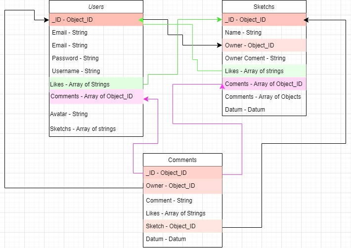

# Spike 21 Notes

## Adding data with POST requests

So far we've been adding all our data manually, then using **get** requests to **read** that data. Let's look at a different type of request: **post**. A 'post' request sends data to the server, it's able to do this because it has a **body**. 

Let's **create** a new user. First, we'll write the back-end functions and test them with Postman. Once it works in Postman, we can use the sample code Postman provides to help us write a fetch function from our React front-end. Start by establishing a new endpoint, and a new function. This time, though, the method for our route will be 'post':

```js
router.post("/register", registerUser);
```

In the **registerUser** function, log `req.body` to the console. We can also have a look at the whole `req` object, though it is very big and complicated! The body property refers to data given into the function when the request is made. On Postman, there is a **body** subheading, this is where we add that data. The options we can choose from (for this project), will be **form-data**, **x-www-form-urlencoded**, or **raw**. Form-data will require a middleware, so avoid this one for now. If you want to use 'raw', make sure to select **JSON** format from the dropdown. 

Create an object that you would send through as a new user - make sure it follows the Schema defined for the collection. Build a new object in your function using those properties and save it as a new Model. Now you can use Mongoose's `.save()` method to save it to the collection linked to that Model. The save method returns the document:

```js
const createUser = async(req, res) => {
  const newUser = new UserModel({
    email: req.body.email,
    password: req.body.password,
    username: req.body.username
  });
  try {
    const result = await newUser.save();
    console.log(result);
    res.status(200).json(result);
  } catch(e) {
    console.log(e);
    res.status(500).send('Server error');
  }
}
```

It's also a good idea to do some validation. If `req.body` is missing any of the required fields, send back an error. `Error code 11000` is linked to attempting to duplicate a property set to be unique, so we can create a custom error message in this case:

```js
const registerUser = async(req, res) => {
  if (!req.body.email|| !req.body.password || !req.body.username) return res.status(406).json({ error: "Please fill out all fields" })
  const newUser = new User({ ...req.body });
  try {
    const result = await newUser.save();
    res.status(200).json(result)
  } catch(e) {
    console.log(e);
    e.code === 11000 ? res.status(406).json({ error: "That email is already registered" }) 
    : res.status(500).json({ error: "Unknown error occured" });
  }
}
```

Once this is working we can create a form in React. A trick to keeping all your object changes to a single handleChange function, is to use [] around a property name to define it from a variable (in this case, the event.target.name), and the value from the event.target.value:

```js
  const handleChange = (e) => {
    setFormObject({
      ...formObject,
      [e.target.name]: e.target.value
    })
  }
```

Now that we've got an object to submit, let's look at Postman's sample code. On the very right-hand side, click on the **</>** button in the sidebar. We can copy and paste this code section by section and adapt it to our own project. We can use `response.ok` to check the status code coming from Express. If it's in the 200 range, it's a successful response. If it's not, we can expect one of our error messages:

```ts
response.ok ? alert("successfully registered!") : alert(result.error)
```

Put some signal after the fetch to communicate to your user if the registration was successful, then test it. We can then check our database to see if our new user is there. 

The same logic can be applied to update a user. I could set a route that recieves an ID as params, then write a function that uses Mongoose's `findByIdAndUpdate()`:

```js
const updateUser = async(req, res) => {
  try {
    const updatedUser = await User.findByIdAndUpdate(req.params.id, req.body, { new: true });
    res.status(200).json(updatedUser);
  } catch(e) {
    console.log(e);
    res.status(500).send(e.message);
  }
}
```

## SQL and Non SQL databases

**SQL** (**Structured Query Language**) refers to databases that use relationships between entries to reduce storage. Instead of duplicating data in multiple places, a link is established to the base location of some data. Relational databases were much more popular back when digital storage was more expensive. Now that developer wages far outweigh the price of storage, the priority is to make _using_ the databases simpler and faster, even if documents are much larger. 

MongoDB is a [**NoSQL**](https://www.mongodb.com/nosql-explained) database, which means there isn't a direct relationship between documents. But we can create something similar by using document IDs and Mongoose's [populate](https://mongoosejs.com/docs/populate.html) methods. The upside for this is that you aren't having to update the same data in multiple locations every time you make a change. The downside is that requesting the data can take longer because you need to make a seperate request for each 'linked' document.

## Populate

To follow the example given in the LMS, each user can have pets - they could have no pets, one pet, or multiple pets. This is known as a **one to many** relationship. The pets will be held in a seperate collection, each pet is it's own document. Each pet can have only one owner, and a pet cannot exist without an owner. This is known as a **many to one** relationship. 

We will need to create a Schema and Model for our pets, along with a routes and controller document to hold the routes and functions. I'll also need to update my userSchema to include a property for pets. Where the documents reference each other, we'll put type: `mongoose.Schema.Types.ObjectId` (this could be condensed into a variable for more readable code), and a **ref** property that will reference the **singular**, **lower-case** name of the collection where the documents to be populated can be found. eg:

```js
const objectId = mongoose.Schema.Types.ObjectId;

const petSchema = new mongoose.Schema({
  animal: { type: String, required: true },
  name: { type: String, required: true },
  owner: { type: objectId, ref: 'user', required: true }
});
```

Make sure to update the UserModel as well. If I don't populate the data, I will get just the ObjectId, so once I've also manually updated my MongoDB documents to reflect my new Schemas, I'll need to use the `populate()` method to populate the 'pets' property with the relevant data:

```js
const getAllUsers = async(req, res) => {
  try {
    const users = await User.find().populate("pets");
    res.status(200).json(users);
  } catch(e) {
    console.log(e);
    res.status(500).json({ error: "something went wrong..." })
  }
}
```

Say, though, that we have private data on our 'user' document. The above method fills the space with the whole document, but we can be more specific. We might only want to pass the user's username and avatar, for example. We want to keep private data, like their email and password, private! So we can specify which properties are to be included (Mongoose docs leave out this object format, but I think it gives clarity):

```js
const getAllWithOwner = async(req, res) => {
  try {
    const pets = await Pet.find().populate({ path: 'owner', select: ['username', 'email'] });
    // const pets = await Pet.find().populate('owner', ['username', 'email']); // without object format
    res.status(200).json(pets);
  } catch (e) {
    console.log(e);
    res.status(500).json({ error: "something went wrong..." })
  }
}
```

It's worth making some visual aids for yourself at this point, so you can keep track of how your documents and collections relate to each other. [This](https://app.diagrams.net/) is a great free resource for building diagrams - here's an example made my a previous student:




## Transactions?
